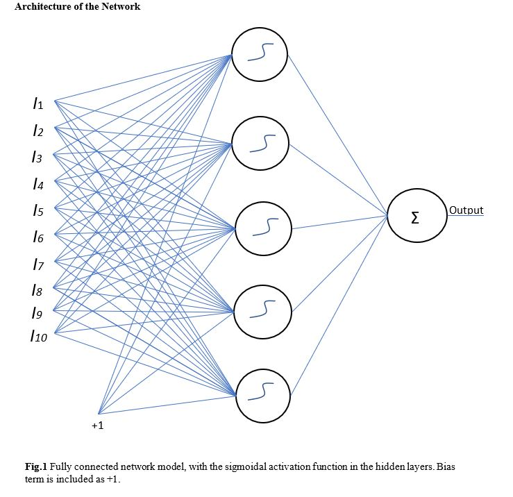
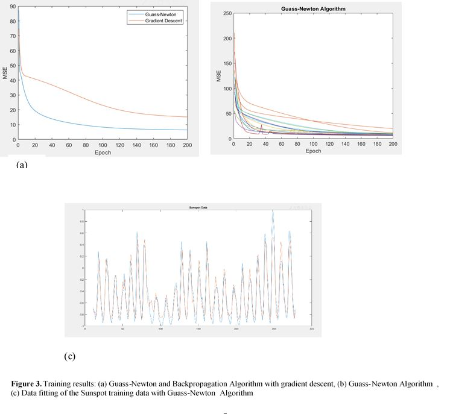
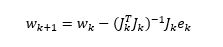
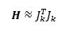
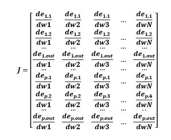
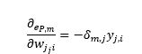
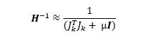

# Guass-Newton-Method-Algorithm
Training Sunspot Data using Guass-newton method (using the Hessian matrix) - Time Series

# Results

Guass-Newton method performs better compared to the backpropogation algorithm and reduces the MSE much faster.

# Guass-Newtons Method

The Gauass-Newtons Method converges very fast although it can be seen as unstable, the computation complexity for this method will only require the computation of Jacobian.

The Hessian can be approximately calculated by J T*J, where J is the Jacobian matrix. The Jacobian matrix consists of size M X W, where M  is the number of patterns and W is the number of weights in the model. It consists of the error of each pattern respect its weights. 

With the traditional backpropagation computation, the elements of the Jacobian matrix can be calculated. It will require the errors (δ) and the inputs (y) of each pattern.

Since the Newtons Method requires the Hessian matrix to be inverted, to make sure this is possible a regularization parameter (µ) and an identity matrix(I) must be added. 

Using the formula above, the Hessian matrix consists of many approximations as seen in , which include the off-diagonal terms which relate to the change of two gradients directions, as the gradient of one direction may change due to the change of direction of another. However, the diagonal approximation explains the gradient of the error shifts in the direction of the weight as it changes. 

The inverse of the Hessian can be approximately be given by 

Thus, the final update rule that will be used is

The inverse Hessian can be seen as the learning rate of the network and is better to use the diagonal approximation to see the error change in terms of weights. Furthermore, it is also recommended that the update rule should be used in a batch mode learning.
